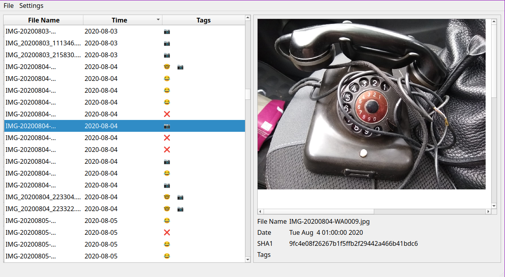

# Picture Possum


A program for manually, but efficiently, tagging and sorting large numbers of images.
Features:
 - duplicate detection
 - creation date inferrence
 - custom tags
 - keyboad shortcuts to quickly tag images
 - json export
 - creating a symlink based index structure in your filesystem according to your tags and creation dates


## Development
### Requirements
(Not tested for other versions, so they may still work)
- cmake 3.28.3
- g++13
- OpenSSL 3.0.13 (optional)
- GTest 1.14.0 (optional)
- Qt 6.4.2

### Ubuntu 24
```shell
sudo apt install -y cmake g++ libssl-dev qt6-base-dev libgtest-dev build-essential 
```

### MacOS
Install [homebrew](https://brew.sh/) beforehand.
```shell
brew install qt@6 openssl@3 googletest
```

### Build
```
mkdir build
cmake -B build
cd build
make
```

### Making .deb releases
Build first (on ubuntu), then use 
```
chmod +x release/ubuntu/makerelease.sh
./release/ubuntu/makerelease.sh version_number release_number
```

### Making pacman releases
```
chmod +x release/arch/makerelease.sh
./release/ubuntu/makerelease.sh version_number [release_number]
```

# Acknowlegements
Made with [Qt](https://www.qt.io/), [TinyEXIF](https://github.com/cdcseacave/TinyEXIF), and [TinySHA1](https://github.com/mohaps/TinySHA1)
